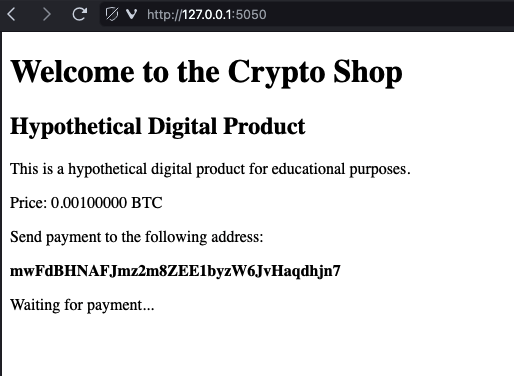

= Bitcoin Testnet RBF Double Spend Demo Shop

== Introduction

This is an educational demonstration of an intentionally insecure digital item 'webshop' designed to accept 0-confirmation Bitcoin Testnet transactions. 

The purpose is to illustrate the concept of link:https://github.com/bitcoin/bips/blob/master/bip-0125.mediawiki[BIP: 125] Replace-By-Fee (RBF) double spending attacks.

== Installation

[source,bash]
----
python -m venv venv
pip install -r requirements.txt
----

== Usage

[source,python]
----
python main.py
----

== License
MIT
